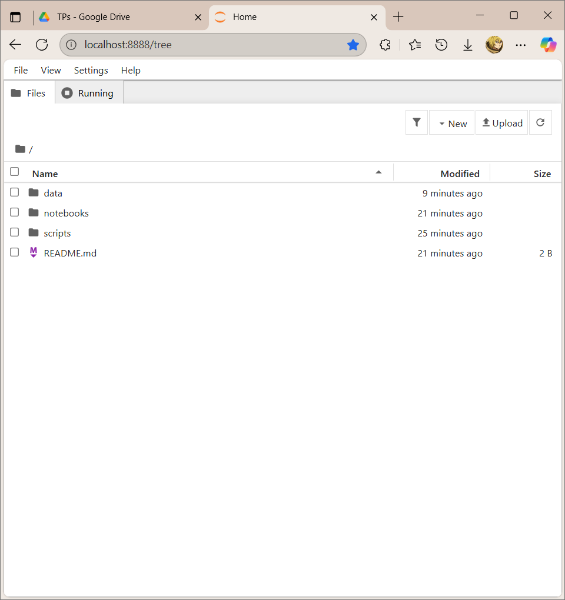
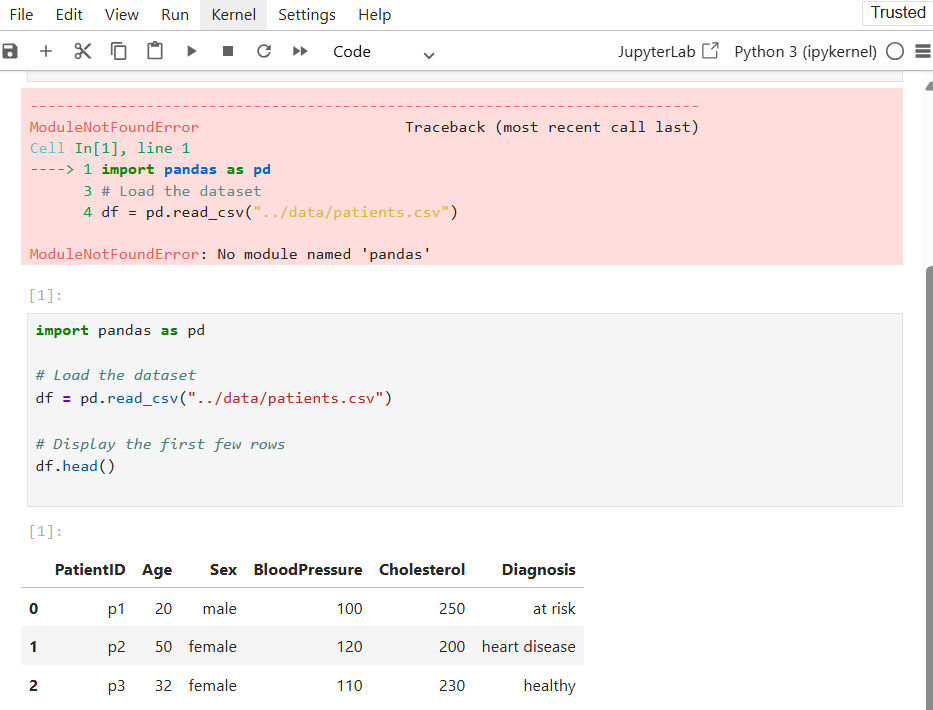
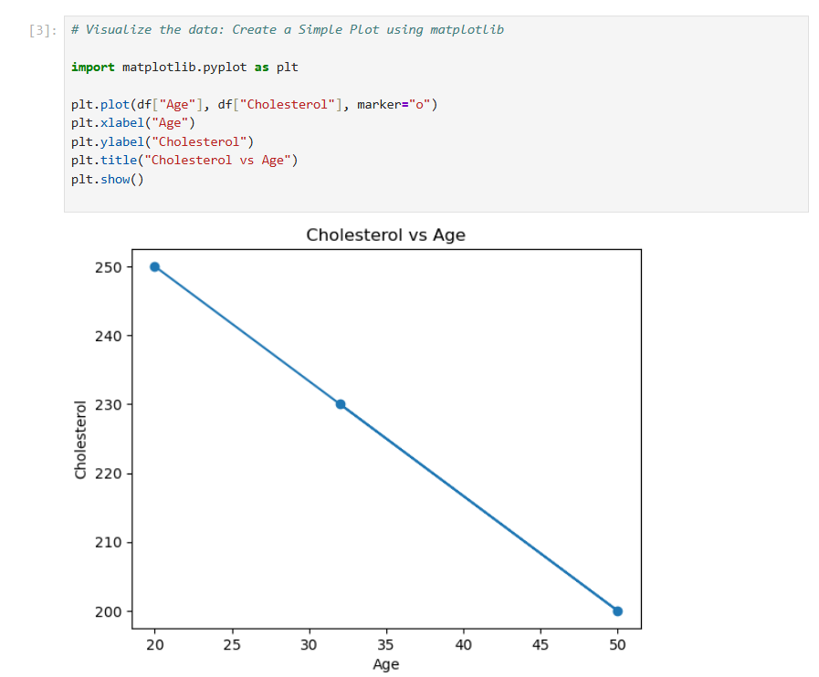
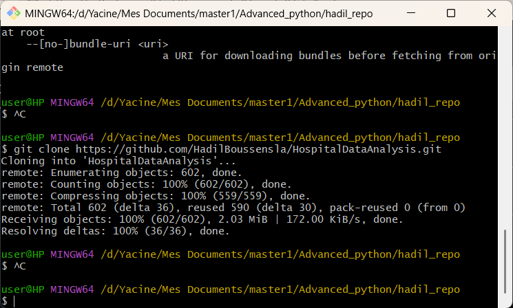
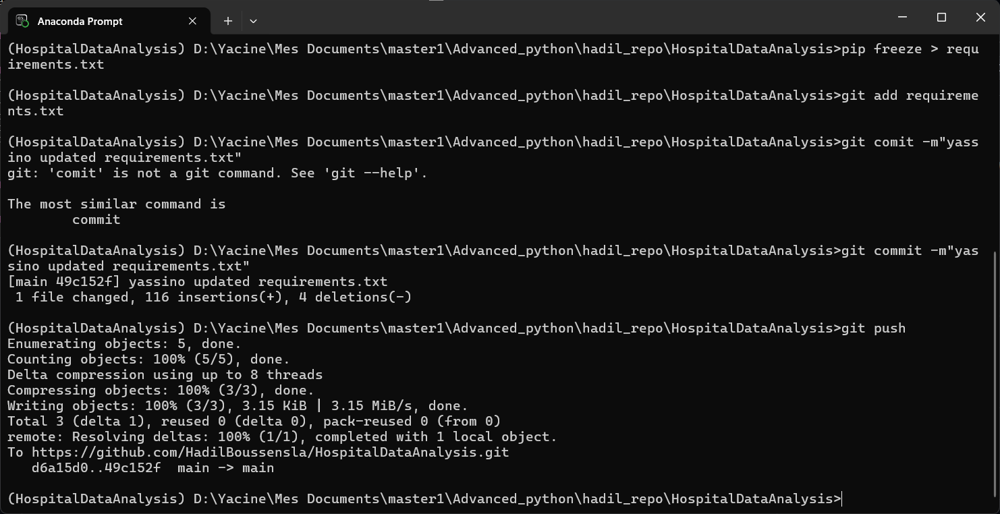
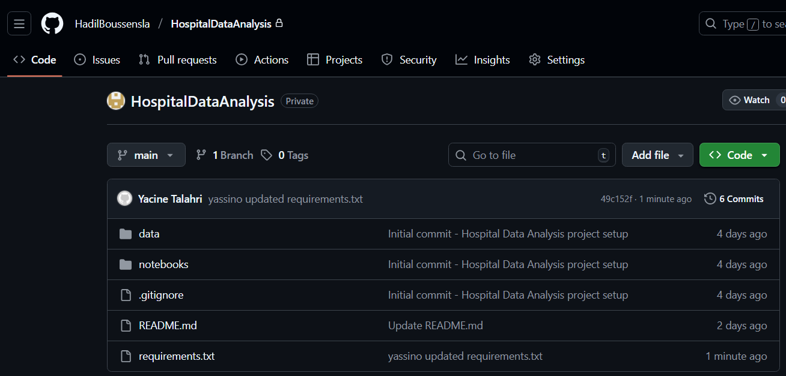

# 🏥 HospitalDataAnalysis

A mini-project for the **Advanced Python** course.
It focuses on manipulating and visualizing hospital patient data using **Python, Pandas, NumPy, and Matplotlib**, inside a custom environment connected to GitHub.

---

## 🎯 Project Goal

The goal is to simulate a complete **data science workflow**, step by step:

1. Create and configure a Python environment
2. Prepare and load a CSV dataset
3. Explore and visualize the data
4. Manage everything with Git and push it to GitHub

By the end, we will have a reproducible project — from raw data to GitHub repository.

---

##  Step 1 – Create the Project Folder

in**Anaconda Prompt**,we navigate to the location where we want to store the project:

```bash

mkdir HospitalDataAnalysis
cd HospitalDataAnalysis
```

Inside the folder, we create this structure:

```
HospitalDataAnalysis/
│
├── data/
├── notebooks/
├── scripts/
├── screenshots/
│
└── README.md
```
i added screenshots 
---

##  Step 2 – Create and Activate the Environment

In Anaconda Prompt:

```bash
conda create -n HosipitalDataAnalysis python=put here ur python version
conda activate HospitalDataAnalysis
```

Install required libraries:

```bash
conda install pandas numpy matplotlib jupyter
```

---

##  Step 3 – Create the Dataset

Inside the `data` folder,we will create a file named **patients.csv** and add the following:

```csv
PatientID,Age,Sex,BloodPressure,Cholesterol,Diagnosis
insert some data
```

Save and close the file.

---

##  Step 4 – Launch Jupyter Notebook

Running Jupyter:

```bash
jupyter notebook
```


In the browser, we goto  **notebooks/** folder and create a new notebook named **patients_analysis.ipynb**.

---

##  Step 5 – Load and Explore the Data

In the first cell:

```python
import pandas as pd

df = pd.read_csv("../data/patients.csv")
df.head()
```

Then explore:

```python
df.info()
df.describe()
df['Diagnosis'].value_counts()
```

### Example Output:


---

##  Step 6 – Visualize the Data

Create visualizations with Matplotlib.


### 6.1 Cholesterol vs Age

```python
import matplotlib.pyplot as plt

plt.scatter(df["Age"], df["Cholesterol"], color="blue")
plt.title("Cholesterol vs Age")
plt.xlabel("Age")
plt.ylabel("Cholesterol")
plt.show()
```


---

### 6.2 Diagnosis Distribution

```python
df['Diagnosis'].value_counts().plot(kind='bar', color=['green','orange','red'])
plt.title("Number of Patients per Diagnosis")
plt.xlabel("Diagnosis")
plt.ylabel("Count")
plt.show()
```



---


##  Step 7 – Initialize Git and Commit the Project

Initialize git:

```bash
git init
```

Create `.gitignore` to exclude unnecessary files:

```
env/
__pycache__/
*.pyc
```

Add and commit everything:

```bash
git add .
git commit -m "Initial commit - TP2 Advanced Python"
```


---

##  Step 8 – Push to GitHub

1. we create a new **GitHub repository** named `HospitalDataAnalysis` (without README, .gitignore, or license).
2. Link your local project:

   ```bash
   git branch -M main
   git remote add origin https://github.com/your-username/HospitalDataAnalysis.git
   git push -u origin main
   ```

## Step 9 – Collaboration: Cloning a Friend’s Repo & Updating Requirements

For the final part of the TP, we collaborated by working with a classmate’s project (Hadil’s repository).
Here’s what we did:

Cloned our friend’s repository using the git clone command.
 ```bash
git clone https://github.com/HadilBoussensla/HospitalDataAnalysis.git
   ```


Activated our own environment inside her project to ensure the same dependencies were available.

conda activate HospitalDataAnalysis



Updated the requirements file to include the full list of dependencies from our environment.

pip freeze > requirements.txt
git add requirements.txt
git commit -m "yassino updated requeirements.txt"
git push



## 🧠 Summary

we :

* Created and managed a Python environment
* Loaded and analyzed real data using Pandas
* Visualized results with Matplotlib
* Version-controlled and published your project on GitHub
* Collaborated by cloning a teammate’s repo and updating dependencies

This project demonstrates a **complete mini data analysis workflow**

---

## 👨‍💻 Author

**Yassine Talahari**
Master 1 – Advanced Python (2025-Boustil)
From CSV → Visualization → GitHub 🚀
